# SENIA Elite 自动对色系统总整理（v2.3.0 全栈版）

更新时间：2026-03-31（Asia/Shanghai）  
代码基线：`D:\color match\autocolor`  
服务基线：`elite_api.py` `APP_VERSION = "2.3.0"`

---

## 1. 当前系统状态（以实测为准）

2026-03-31 当日实测通过：

1. `system_quick_check.ps1`：`PASSED`
2. `run_full_e2e_flow.py`：`E2E PASSED`
3. `run_release_gate.ps1 -RequireSloHealthy`：`overall ok: True`

当前健康快照：

- 服务版本：`2.3.0`
- 运行路由数（status口径）：`59`
- 代码显式业务路由（@app.get/@app.post）：`55`
- 默认对外端口：`8877`

---

## 2. 系统目标（客户 / 老板 / 公司三视角）

1. 客户视角：色差稳定、可追溯、可解释，降低客诉与退货。
2. 老板视角：在质量与吞吐之间自动寻优，减少人工依赖与波动。
3. 公司视角：形成可治理、可审计、可持续优化的无人化对色闭环系统。

---

## 3. 全链路业务闭环

```mermaid
flowchart LR
  A[采集图像/上传文件] --> B[对色核心引擎 elite_color_match]
  B --> C[工艺建议 elite_process_advisor]
  C --> D[决策中心 elite_decision_center]
  D --> E[创新引擎 elite_innovation_engine]
  E --> F[历史入库 quality_runs]
  F --> G[结果回写 quality_outcomes]
  G --> H[策略学习与优化
policy-lab/counterfactual/bandit/rollout]
  H --> I[管理看板与执行简报
web dashboard/brief]
  I --> J[发布门禁与运维治理
quick-check/e2e/release-gate]
```



---

## 4. 全栈架构分层

### 4.1 后端主干

- API编排层：`D:\color match\autocolor\elite_api.py`
- 运行时配置中心：`D:\color match\autocolor\elite_runtime.py`
- Web前端模板层：`D:\color match\autocolor\elite_web_console.py`

### 4.2 视觉与色差核心层

- 对色核心：`D:\color match\autocolor\elite_color_match.py`

关键能力：

1. 单图模式（自动识别大板+小样）
2. 双图模式（样板 vs 彩膜）
3. 批量模式（batch）
4. 融合模式（ensemble）
5. ArUco工位定位
6. ROI/四点强制兜底
7. 光照与纹理稳健化（白平衡 + shading correction + invalid mask）
8. 质量置信度与质量旗标

### 4.3 决策与学习层

- 工艺建议引擎：`D:\color match\autocolor\elite_process_advisor.py`
- 决策中心：`D:\color match\autocolor\elite_decision_center.py`
- 客户分层：`D:\color match\autocolor\elite_customer_tier.py`
- Policy Lab：`D:\color match\autocolor\elite_policy_lab.py`
- 反事实孪生：`D:\color match\autocolor\elite_counterfactual.py`
- Champion-Challenger：`D:\color match\autocolor\elite_rollout_engine.py`
- LinUCB策略编排：`D:\color match\autocolor\elite_open_bandit.py`

### 4.4 创新算法层（8大模块）

- 引擎：`D:\color match\autocolor\elite_innovation_engine.py`
- 状态持久化：`D:\color match\autocolor\elite_innovation_state.py`

---

## 5. 算法体系总览

### 5.1 视觉对色核心算法

主流程：

1. 检测几何区域（轮廓候选 + 大板/小样选择）
2. 透视矫正与区域归一
3. 白平衡、光照场校正、纹理抑制、无效像素剔除
4. 网格采样（如 6x8）
5. CIEDE2000 计算与 dL/dC/dH 分解
6. 输出 `avg/p95/max` + `quality_flags` + `capture_guidance`

置信度计算（代码内）：

- `overall = 0.40*geometry + 0.32*lighting + 0.28*coverage`

### 5.2 工艺建议引擎

- 规则文件：`process_action_rules.json`
- 安全表达式（AST白名单）
- 输出：风险等级、命中规则、建议动作

### 5.3 决策中心算法

- 决策码：
  - `AUTO_RELEASE`
  - `MANUAL_REVIEW`
  - `RECAPTURE_REQUIRED`
  - `HOLD_AND_ESCALATE`
- 风险来源：`avg_ratio/p95_ratio/max_ratio/confidence/flags`
- 同时输出三方分：`customer_score / boss_score / company_score`
- 输出预计成本：人工复核/重拍/停线/逃逸损失综合估计

### 5.4 闭环学习与优化算法

1. 历史策略建议：`recommend_policy_adjustments`
2. Policy Lab：多策略离线仿真 + Pareto前沿
3. Counterfactual Twin：GBR + Conformal 区间预测
4. Champion-Challenger：自动给出 `PROMOTE/CANARY/REJECT`
5. Open Bandit（LinUCB）：动态策略推荐

### 5.5 8个创新模块（已工程化接入）

1. `SpectralReconstructor`：RGB反推光谱 + 同色异谱风险
2. `TextureAwareDeltaE`：纹理掩蔽/放大对色差判定调制
3. `DriftPredictor`：贝叶斯趋势 + CUSUM 变点 + 超标批次数预测
4. `ColorAgingPredictor`：1/3/5/10/15年老化与差异老化预测
5. `InkRecipeCorrector`：dL/dC/dH 反推 CMYK 修正处方
6. `BatchBlendOptimizer`：多批次分组优化 + VIP优先分配
7. `CustomerAcceptanceLearner`：客户容忍度在线学习 + 动态阈值
8. `ColorPassport`：色彩护照签名 + 防篡改 + 到货漂移验证

---

## 6. 前端体系（Web可访问）

前端代码：`D:\color match\autocolor\elite_web_console.py`

页面：

1. 首页控制台 `/`
2. 经营驾驶舱 `/v1/web/executive-dashboard`
3. 执行简报页 `/v1/web/executive-brief`

前端能力：

- 单图/双图上传对色
- 实时调用系统状态与历史经营接口
- 输出关键KPI、风险等级、建议动作
- 响应式布局（移动端断点已配置）
- 统一暗色工业风设计（非模板化默认样式）

---

## 7. 后端API全景（按域分组）

### 7.1 系统治理域（13）

- `/v1/system/status`
- `/v1/system/metrics`
- `/v1/system/slo`
- `/v1/system/auth-info`
- `/v1/system/tenant-info`
- `/v1/system/alert-test`
- `/v1/system/alert-dead-letter`
- `/v1/system/alert-replay`
- `/v1/system/ops-summary`
- `/v1/system/executive-brief`
- `/v1/system/release-gate-report`
- `/v1/system/audit-tail`
- `/v1/system/self-test`

### 7.2 对色执行域

- `/v1/analyze/single`
- `/v1/analyze/dual`
- `/v1/analyze/batch`
- `/v1/analyze/ensemble`
- `/v1/web/analyze/single-upload`
- `/v1/web/analyze/dual-upload`

### 7.3 创新域

- `/v1/analyze/spectral`
- `/v1/analyze/texture-aware`
- `/v1/analyze/full-innovation`
- `/v1/history/drift-prediction`
- `/v1/predict/aging`
- `/v1/predict/differential-aging`
- `/v1/correct/ink-recipe`
- `/v1/optimize/batch-blend`
- `/v1/customer/acceptance-record`
- `/v1/customer/acceptance-profile`
- `/v1/customer/complaint-probability`
- `/v1/customer/dynamic-threshold`
- `/v1/passport/generate`
- `/v1/passport/verify`
- `/v1/innovation/manifest`

### 7.4 历史与经营分析域

- `/v1/history/overview`
- `/v1/history/early-warning`
- `/v1/history/outcomes`
- `/v1/history/outcome-kpis`
- `/v1/history/policy-recommendation`
- `/v1/history/policy-lab`
- `/v1/history/counterfactual-twin`
- `/v1/history/open-bandit-policy`
- `/v1/history/executive`
- `/v1/history/executive-export`
- `/v1/history/runs`

### 7.5 其他核心接口

- `/v1/outcome/record`
- `/v1/strategy/champion-challenger`
- `/v1/policy/customer-tier`
- `/v1/profiles`
- `/v1/report/html`
- `/health`
- `/ready`

---

## 8. 数据架构

### 8.1 质量闭环数据库（`quality_history.sqlite`）

核心表：

1. `quality_runs`
2. `quality_outcomes`

承载内容：

- 检测结果（pass/confidence/avg_de/p95_de/max_de/dL/dC/dH）
- 决策结果（decision_code/priority/risk/cost/三方分）
- 业务结果（投诉/退货/返工/成本/评分）

### 8.2 创新状态数据库（`innovation_state.sqlite`）

核心表：

1. `innovation_customer_acceptance_events`
2. `innovation_customer_acceptance_models`
3. `innovation_color_passports`

承载内容：

- 客户容忍度学习事件与模型快照
- 色彩护照存储与回查验证

---

## 9. 安全、治理与可审计

### 9.1 鉴权与角色

- 角色等级：`viewer < operator < admin`
- 可通过 `ELITE_ENABLE_API_KEY_AUTH=true` 开启
- Key映射支持两种JSON格式（角色->key 或 key->角色）

### 9.2 租户隔离

- 可强制租户头：`ELITE_ENFORCE_TENANT_HEADER=true`
- 支持租户白名单：`ELITE_ALLOWED_TENANTS`

### 9.3 限流与防护

- 租户+IP维度限流（RPM）
- 默认安全响应头（nosniff/deny/referrer-policy 等）
- Query敏感字段自动脱敏写审计

### 9.4 审计与追溯

- 审计日志：`logs\elite_audit.jsonl`
- 支持滚动与备份
- `/v1/system/audit-tail` 可在线查看尾部

---

## 10. 运维可靠性与告警体系

### 10.1 健康与SLO

- `/ready`：就绪探针（失败返回503）
- `/v1/system/self-test`：依赖完整性自检
- `/v1/system/slo`：可用性+时延SLO（支持排除分析重路由）

### 10.2 告警链路

- Provider：`webhook / wecom / dingtalk`
- 分级路由：`ELITE_ALERT_WEBHOOK_MAP_JSON`
- 重试与退避：`ELITE_ALERT_RETRY_*`
- 失败死信队列：`/v1/system/alert-dead-letter`
- 死信重放：`/v1/system/alert-replay`

### 10.3 管理驾驶舱

- `/v1/system/ops-summary`：运维总览
- `/v1/system/executive-brief`：GO/NO_GO 执行简报
- `/v1/web/executive-dashboard`：老板视角页面
- `/v1/web/executive-brief`：简报可视化页面

---

## 11. 发布门禁与全流程验收

脚本：

1. `D:\color match\autocolor\system_quick_check.ps1`
2. `D:\color match\autocolor\run_full_e2e_flow.py`
3. `D:\color match\autocolor\run_release_gate.py`
4. `D:\color match\autocolor\run_release_gate.ps1`

门禁覆盖：

- 基础健康与就绪
- 系统状态、指标、SLO
- 自检、审计、告警链路
- 前端页面探针
- analyze/batch/ensemble 全链路
- 创新模块全链路
- 闭环记录与历史分析
- 可选角色边界验证

---

## 12. 部署与网页访问

启动：

```powershell
powershell -ExecutionPolicy Bypass -File "D:\color match\autocolor\run_elite_api.ps1" -ApiHost 0.0.0.0 -Port 8877
```

入口：

- 本机：`http://127.0.0.1:8877/`
- 文档：`http://127.0.0.1:8877/docs`
- 局域网：`http://<本机IP>:8877/`

若局域网访问失败，可开放防火墙：

```powershell
powershell -ExecutionPolicy Bypass -File "D:\color match\autocolor\open_api_firewall_8877.ps1"
```

---

## 13. 项目整洁度与结构建议（当前已执行）

1. 业务逻辑按模块拆分，避免单文件算法堆叠。
2. 配置模板集中在 `elite_runtime.env.example`。
3. 发布门禁报告统一落地到 `out_e2e_flow\release_gate_result.json`。
4. 默认脚本全部非交互，可持续用于CI或现场运维。
5. 前后端入口清晰：`elite_api.py` + `elite_web_console.py`。

---

## 14. 下一阶段可继续冲顶的方向

1. 增加多相机标定与跨设备颜色域统一（设备级漂移补偿）。
2. 引入在线主动学习（对低置信/高价值样本优先标注回流）。
3. 建立多工厂多租户模型参数中心（策略分发+版本回滚）。
4. 将 release gate 接入定时任务和灰度发布流水线。
5. 在 dashboard 增加 KPI 时间序列图与异常根因联动钻取。

---

这份文档即当前 `v2.3.0` 的统一全栈基线，可直接用于：

- 对外售前演示
- 内部技术评审
- 研发交接与运维手册
- 上线前门禁清单
